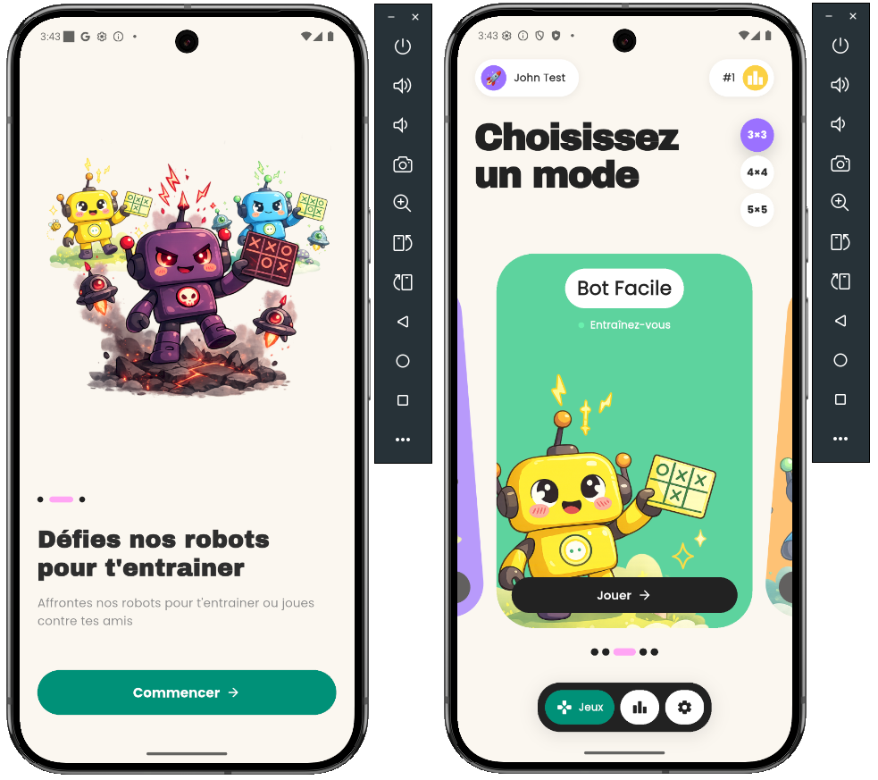

# Align! 🎯

> Application Flutter de Tic-Tac-Toe (Morpion) avec matchmaking en ligne, authentification Firebase et IA multi-niveaux.



---

## 📋 Table des matières

- [Vue d'ensemble](#-vue-densemble)
- [Fonctionnalités](#-fonctionnalités)
- [Architecture technique](#-architecture-technique)
- [Stack technique](#-stack-technique)
- [Décisions d'architecture clés](#-décisions-darchitecture-clés)
- [Stratégies d'IA](#-stratégies-dia)
- [Setup du projet](#-setup-du-projet)
- [Tests](#-tests)
- [Structure du projet](#-structure-du-projet)
- [Évolutions futures](#-évolutions-futures)

---

## 🎮 Vue d'ensemble

**Align!** est une application mobile Flutter de Morpion moderne avec support de multiples tailles de grilles (3×3, 4×4, 5×5).

L'application propose :
- **Jeu local** contre une IA avec 3 niveaux de difficulté
- **Matchmaking en ligne** (PvP temps réel via Firestore)
- **Système d'authentification** complet avec onboarding personnalisé
- **Historique des parties**

Ce projet a été conçu comme **test technique Flutter senior**, avec un accent particulier sur :
- L'architecture scalable et maintenable
- La gestion d'état robuste avec Riverpod
- L'intégration Firebase
- Les bonnes pratiques de développement mobile

---

## ✨ Fonctionnalités

### 🎲 Modes de jeu

- **Local (PvE)** : Affrontez une IA avec 3 niveaux de difficulté
  - **Facile** : Coups aléatoires
  - **Moyen** : Tactiques de base (bloquer, gagner, priorité centre/coins)
  - **Difficile** : Heuristiques avancées (création de fourchettes, analyse multi-menaces)

- **Local (PvP)** : Affrontez vos amis sur le même téléphone

- **En ligne (PvP)** : Matchmaking automatique temps réel
  - Quick join : rejoindre une partie existante
  - Création de room si aucune partie disponible
  - Synchronisation Firestore en temps réel
  - Système d'abandon (l'adversaire gagne automatiquement)

### 🧑 Authentification & Profil

- **Signup** : Flow en 2 étapes (identité + credentials)
  - Choix d'un pseudo (3-15 caractères)
  - Sélection d'un avatar emoji parmi 20 options
  - Email/mot de passe (validation Firebase)
- **Transaction atomique** : Si la création du profil Firestore échoue, rollback automatique du user Firebase Auth pour éviter les utilisateurs orphelins
- **Login** : Email/mot de passe avec gestion d'erreurs explicites
- **Profil éditable** : Modification du pseudo et de l'emoji depuis les paramètres

### 📊 Historique

- Liste des 50 dernières parties jouées
- Affichage détaillé (adversaire, taille de grille, mode de jeu)
- Timestamp de chaque partie

### 🎨 UI/UX

- **Onboarding** : Écran d'accueil avec présentation du jeu
- **Thème personnalisé** : Avec une architecture de couleurs et Google Fonts (Poppins et Archivo Black)
- **Animations** : Utilisation de `flutter_animate` et animation maison pour le défilement des modes de jeux
- **Confettis** : Célébration des victoires

---

## 🏗️ Architecture technique

L'application suit une **architecture en couches** inspirée de la Clean Architecture :

```
lib/
├── domain/         → Logique métier pure (0 dépendance Flutter/Firebase)
├── data/           → Repositories et services externes (Firebase, SharedPreferences)
├── app/            → Application logic (Controllers Riverpod, Router, Theme)
└── ui/             → Presentation layer (Screens, Widgets)
```

### Principes respectés

- **Separation of Concerns** : Chaque couche a une responsabilité unique
- **Dependency Inversion** : Le domain ne dépend de rien, les couches supérieures dépendent du domain
- **Testability** : Logique métier testable sans mocks (pure Dart)
- **Immutability** : Utilisation de Freezed pour les states critiques (Auth, Profile, Game)

---

## 🛠️ Stack technique

| Catégorie | Technologies |
|-----------|-------------|
| **Framework** | Flutter 3.10+ |
| **Langage** | Dart 3.10+ |
| **State Management** | Riverpod 3.1 (Notifiers + AsyncNotifiers) |
| **Navigation** | GoRouter 14.6 (redirects auth-aware) |
| **Backend** | Firebase Auth + Cloud Firestore |
| **Code Generation** | Freezed 3.2, Build Runner |
| **UI** | Google Fonts, Flutter Animate, Confetti |
| **Tests** | flutter_test, test package |

---

## 🧠 Décisions d'architecture clés

### 1. Pas de couche Use Cases explicite

**Choix** : Les controllers Riverpod orchestrent directement les appels aux repositories.

**Justification** :
- Pour une application de cette taille, les `Notifier<T>` Riverpod jouent déjà le rôle d'orchestrateurs (équivalent aux use cases)
- Ajouter une couche supplémentaire serait de la **sur-ingénierie** sans gain de maintenabilité
- En production, si les flows deviennent complexes (ex: système de tournois, classement ELO), je refactoriserais vers des use cases

**Trade-off assumé** : Moins de granularité dans la réutilisabilité, mais **meilleure vélocité de développement** et code plus lisible.

---

### 2. Transaction atomique Auth + Firestore

**Problème** : Lors du signup, si Firebase Auth réussit mais que Firestore échoue (réseau, permissions), on crée un utilisateur orphelin → impossible de se connecter ensuite.

**Solution** : Rollback automatique dans [auth_repository.dart](lib/data/auth/auth_repository.dart) :

```dart
Future<SignUpResult> signUp(...) async {
  UserCredential? credential;

  try {
    // 1. Créer Firebase Auth User
    credential = await _authService.signUpWithEmail(...);

    // 2. Créer Firestore Profile
    final profile = UserProfile(...);
    await _profileRepository.createProfile(profile);

    return SignUpResult.success(credential.user, profile);
  } catch (e) {
    // ROLLBACK : Supprimer le user Firebase si le profil a échoué
    if (credential?.user != null) {
      try {
        await credential!.user!.delete();
      } catch (e) {
        AppLogger.error('Rollback failed - orphaned user', error: e);
      }
    }
    return SignUpResult.failure('Erreur lors de la création du profil');
  }
}
```

**Résultat** : Garantie de cohérence entre Firebase Auth et Firestore.

---

### 3. Synchronisation temps réel des parties en ligne

**Architecture** :

1. **Création de room** : Un joueur crée une room Firestore avec `status: waiting`
2. **Matchmaking** : L'autre joueur fait un quick join (query Firestore pour trouver une room disponible)
3. **Stream Firestore** : Chaque joueur écoute la room via `watchRoom(roomId).listen(...)`
4. **Optimistic updates** : Le joueur qui joue met à jour Firestore, le stream notifie l'adversaire

**Gestion d'erreurs** :
- Si le stream Firestore renvoie 5 erreurs consécutives (réseau, permissions), on cleanup le listener pour éviter les **memory leaks**
- Système d'abandon : si un joueur quitte, l'adversaire gagne automatiquement

**Trade-off** :
- ✅ Simple à implémenter, latence acceptable (<500ms sur connexion mobile)
- ❌ Pas de reconnexion automatique après déconnexion (nécessiterait un backend custom)

---

### 4. Stratégie de navigation avec GoRouter

**Redirect logic** auth-aware dans [router.dart](lib/app/router.dart) :

```dart
redirect: (context, state) {
  final authState = ref.read(authControllerProvider);
  final profileState = ref.read(profileControllerProvider);

  // 1. Auth en chargement → attendre
  if (authState.isLoading) return null;

  // 2. Non authentifié → onboarding
  if (!authState.isAuthenticated) return Routes.onboarding;

  // 3. Profil en chargement → attendre
  if (profileState.isLoading) return null;

  // 4. Profil manquant → signup (completion de profil)
  if (profileState.profile == null) return Routes.signup;

  // 5. Tout OK → laisser passer
  return null;
}
```

**RefreshNotifier** : Écoute simultanée de `authController` ET `profileController` pour re-évaluer les redirects.

---

## 🤖 Stratégies d'IA

L'IA du jeu local utilise le **Strategy Pattern** avec 3 implémentations dans [bot_strategy.dart](lib/domain/game/bot/bot_strategy.dart) :

### Niveau Facile (`EasyBotStrategy`)

```dart
selectMove() → coup aléatoire parmi les cases vides
```

**Objectif** : Laisser gagner les débutants.

---

### Niveau Moyen (`MediumBotStrategy`)

**Tactiques** :
1. ✅ Gagner immédiatement si possible
2. ✅ Bloquer l'adversaire s'il peut gagner
3. ✅ Prendre le centre (3×3)
4. ✅ Prendre un coin disponible
5. ✅ **15% de randomness** pour éviter une IA trop prévisible

**Objectif** : Adversaire compétitif mais battable.

---

### Niveau Difficile (`HardBotStrategy`)

**Heuristiques avancées** :
1. ✅ Gagner immédiatement
2. ✅ Bloquer l'adversaire
3. ✅ Prendre le centre (3×3)
4. ✅ **Créer une fourchette** : jouer un coup qui ouvre 2+ menaces simultanées
5. ✅ **Bloquer une fourchette adverse**
6. ✅ **Jouer sur la meilleure ligne** : prioriser les lignes avec plusieurs coups déjà placés
7. ✅ Prendre une position stratégique (centre, coins, cases adjacentes au centre sur 4×4+)

**Objectif** : IA très difficile à battre, sans minimax complet (trop coûteux sur 5×5).

---

## 🚀 Setup du projet

### Prérequis

- Flutter 3.10+ ([Installation](https://docs.flutter.dev/get-started/install))
- Dart 3.10+

### Installation

1. **Cloner le projet**

```bash
git clone https://github.com/mickamgd/align.git
cd align
```

2. **Installer les dépendances**

```bash
flutter pub get
```

3. **Générer le code Freezed**

```bash
dart run build_runner build --delete-conflicting-outputs
```

4. **Lancer l'app**

```bash
flutter run
```

### 🔥 Note sur Firebase

Le projet est **pré-configuré avec Firebase en mode test** pour faciliter l'évaluation :

- Les fichiers de configuration Firebase (`google-services.json`, `GoogleService-Info.plist`, `firebase_options.dart`) sont inclus dans le repo
- Firestore est configuré en **mode test**
- L'index composite Firestore pour l'historique est déjà créé

> ⚠️ **En production**, ces fichiers seraient dans `.gitignore` et Firestore serait sécurisé avec des Security Rules strictes.

---

## 🧪 Tests

### Tests unitaires

L'application contient des tests sur la **logique métier** (domain layer) :

#### Tests des règles du jeu

**Fichier** : [test/domain/game/rules_test.dart](test/domain/game/rules_test.dart)

```dart
// Vérifie la détection de victoire sur lignes, colonnes, diagonales
// Vérifie la détection de match nul
// Teste les grilles 3×3, 4×4, 5×5
```

Exécuter :

```bash
flutter test test/domain/game/rules_test.dart
```

#### Tests des stratégies de bot

**Fichier** : [test/domain/bot/bot_test.dart](test/domain/bot/bot_test.dart)

```dart
// EasyBot → Vérifie que les coups sont aléatoires et valides
// MediumBot → Vérifie blocage et victoire immédiate
// HardBot → Vérifie création de fourchettes et analyse multi-menaces
```

Exécuter :

```bash
flutter test test/domain/bot/bot_test.dart
```

### Lancer tous les tests

```bash
flutter test
```

### Tests d'intégration (non implémentés)

En production, j'ajouterais :
- Tests d'intégration avec **Firebase Emulator Suite**
- Tests sur les flows critiques : signup, matchmaking, completion de partie
- Golden tests pour validation UI

**Justification du choix** : Les tests unitaires domain couvrent la logique métier (règles, IA). Les tests controllers nécessiteraient de mocker Firebase, ce qui était hors scope pour un test technique.

---

## 📁 Structure du projet

```
lib/
├── app/                              → Application logic layer
│   ├── auth/
│   │   ├── auth_controller.dart      → Riverpod Notifier (Firebase Auth state)
│   │   └── auth_state.dart           → Freezed state (user, loading, error)
│   ├── profile/
│   │   ├── profile_controller.dart   → Gestion du profil Firestore
│   │   └── profile_state.dart
│   ├── game/
│   │   ├── game_controller.dart      → Jeu local (PvE)
│   │   ├── game_state.dart           → État de la partie (board, status, winner)
│   │   └── game_config.dart          → Config (size, mode, difficulty)
│   ├── online/
│   │   ├── online_game_controller.dart → Jeu en ligne (étend GameController)
│   │   └── online_providers.dart       → Providers Riverpod pour online
│   ├── history/
│   │   └── history_controller.dart   → Historique des parties
│   ├── router.dart                   → GoRouter (redirects auth-aware)
│   ├── theme.dart                    → AppColors, AppTextStyles, AppSpacing
│   └── app.dart                      → Widget root
│
├── data/                             → Data layer (repositories & services)
│   ├── auth/
│   │   ├── auth_repository.dart      → Orchestration Auth + Profile (transaction atomique)
│   │   └── firebase_auth_service.dart → Wrapper Firebase Auth
│   ├── profile/
│   │   └── profile_repository.dart   → CRUD Firestore users
│   ├── game/
│   │   └── history_repository.dart   → CRUD Firestore game_history
│   └── online/
│       └── online_room_repository.dart → CRUD Firestore online_rooms
│
├── domain/                           → Business logic (pure Dart)
│   ├── game/
│   │   ├── board.dart                → Immutable Board (cells, size, place, isEmptyAt)
│   │   ├── rules.dart                → Évaluation victoire/égalité (sealed class GameResult)
│   │   ├── player.dart               → Enum Player { x, o }
│   │   ├── player_info.dart          → Infos joueur (displayName, emoji, uid)
│   │   ├── game_history.dart         → Model historique de partie
│   │   └── bot/
│   │       └── bot_strategy.dart     → Strategy Pattern (Easy, Medium, Hard)
│   ├── profile/
│   │   ├── user_profile.dart         → Model profil utilisateur
│   │   └── emoji_catalog.dart        → Liste des 10 emojis disponibles
│   └── online/
│       └── online_room.dart          → Model room Firestore
│
├── ui/                               → Presentation layer
│   ├── auth/
│   │   ├── onboarding_screen.dart    → Écran d'accueil
│   │   ├── login_screen.dart
│   │   └── signup_flow/
│   │       ├── signup_flow_screen.dart → PageView 2 étapes
│   │       ├── signup_step_identity.dart → Étape 1 (pseudo + emoji)
│   │       └── signup_step_credentials.dart → Étape 2 (email + password)
│   ├── home/
│   │   └── home_screen.dart          → Sélection mode de jeu
│   ├── game/
│   │   └── game_screen.dart          → Plateau de jeu (local + online)
│   ├── online/
│   │   └── online_lobby_screen.dart  → Matchmaking (attente adversaire)
│   ├── history/
│   │   └── history_screen.dart       → Liste des parties jouées
│   ├── settings/
│   │   └── settings_screen.dart      → Édition profil, déconnexion
│   └── shared/
│       ├── custom_text_field.dart    → TextField réutilisable
│       └── firestore_error.dart      → Mapping erreurs Firestore → messages user-friendly
│
├── core/                             → Utilities
│   ├── logger.dart                   → AppLogger (logs debug uniquement)
│   └── ui_helpers.dart               → Snackbars, dialogs
│
└── main.dart                         → Entry point (Firebase init + ProviderScope)
```

---

## 🔮 Évolutions futures

### Features

- [ ] **Reconnexion automatique** : Si un joueur se déconnecte, sauvegarder le `roomId` et lui permettre de reprendre
- [ ] **Timeout de partie** : Si un joueur est inactif 30s, abandon automatique
- [ ] **Système de classement** : ELO/ranking pour le matchmaking compétitif
- [ ] **Notifications push** : "C'est votre tour !" (Firebase Cloud Messaging)
- [ ] **Avatars personnalisés** : Upload d'image via Firebase Storage
- [ ] **Mode spectateur** : Regarder des parties en cours
- [ ] **Tournois** : Organisation de brackets avec élimination directe

### Architecture

- [ ] **Use cases explicites** : Si les flows deviennent complexes (tournois, challenges, amis)
- [ ] **Backend custom** : Remplacer Firestore par un backend Node.js/Dart Frog pour :
  - Reconnexion robuste avec WebSockets
  - Validation serveur des coups (anti-triche)
  - Matchmaking basé sur l'ELO
- [ ] **Tests d'intégration** : Firebase Emulator + tests E2E avec `patrol`
- [ ] **CI/CD** : GitHub Actions pour build + deploy automatique (Firebase App Distribution)

### Performance

- [ ] **Optimisation des rebuilds** : Audit avec DevTools + ajout de `select()` ciblés
- [ ] **Lazy loading** : Pagination sur l'historique (actuellement limité à 50)
- [ ] **Offline-first** : Utiliser Firestore offline persistence pour jouer sans réseau

---

## 📝 Notes techniques

### Logs

- Les logs (`AppLogger`) sont **uniquement actifs en debug** (`kDebugMode`)
- Production : Les logs sont désactivés automatiquement

### Firebase Analytics & Crashlytics

Non configurés dans ce projet (hors scope test technique).

### Gestion des erreurs

- **Firestore errors** : Mappés vers des messages user-friendly dans [firestore_error.dart](lib/ui/shared/firestore_error.dart)
- **Firebase Auth errors** : Mappés dans [auth_repository.dart](lib/data/auth/auth_repository.dart)
- **Erreurs réseau** : Gérées avec try/catch et affichage de snackbars

### Sécurité

- **Email verification** : Non activé (feature désactivée pour simplifier l'UX)
